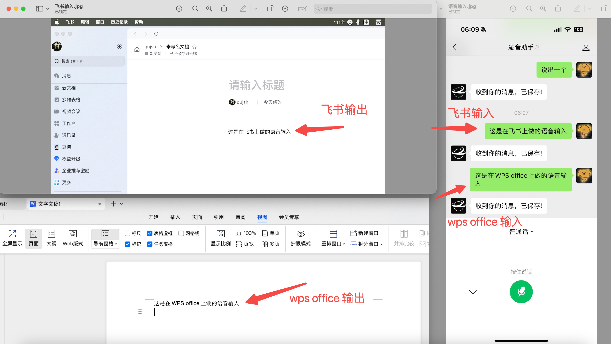

这是[`凌音助手`]在桌面端（electron）下的项目应用，当前版本需要配合微信服务号[`凌音助手`]使用。

### 功能示例一：


在微信服务号[`凌音助手`]中发送普通输入或语音输入的文本后，可以在安装了[`凌音助手`]的PC的app上输出文本，
它是个跨系统跨应用的文本转发工具。

比如：你在服务号[`凌音助手`]上输入“功能测试”，可以在编辑器、
飞书、钉钉、word或其他任何可以输入文本的app上输出。

官网地址：[凌音助手](https://nextvoice.cn)

## 应用场景：
- 实体书籍的笔记记录：在阅读书籍时希望快速做笔记记录，我现在喜欢笔记记录在飞书-云文档。我不喜欢看一半停下来打字，
但又希望快速做笔记记录，就能通过该工具做快速语音记录；
- 待填充

## 下载地址：

- [darwin](https://nextjs.org/docs) - 可在 Intel Mac 和 Apple Silicon 上运行
- [windows-x64](https://nextjs.org/learn) - 可在 windows x64版本上运行

## 本地启动

默认配置文件：config.mjs

```bash
#默认连接远程服务器，可试验PC端效果
npm run cdn:electron  

#本地启动后端服务时使用，后端项目暂未开源
npm run electron  
```
