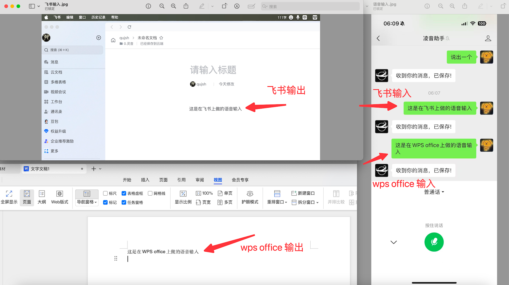

### 描述：
这是[`凌音助手`]在桌面端（electron）下的项目应用，当前版本功能是将微信服务号[`凌音助手`][`语音或文本输入`]内容在PC端APP做输出。

比如：你在服务号[`凌音助手`]上输入“文本测试”，可以在编辑器、飞书、钉钉、word或其他任何可以输入文本的app上输出“文本测试”。

### 功能示例一：


- PC端已成功安装[`凌音助手`]应用；
- 先打开“飞书”点击具体要输入文本位置，然后在微信服务号[`凌音助手`]中发送“这是在飞书上做的语音输入”，会在飞书中做输出；
- 再打开“wps”点击具体要输入文本位置，然后在微信服务号[`凌音助手`]中发送“这是在wps上做的语音输入”，会在wps中做输出；
- 它是个跨系统跨应用的文本转发工具。

官网地址：[凌音助手](https://nextvoice.cn)

## 应用场景：
- 实体书籍的笔记记录：在阅读书籍时希望快速做笔记记录，我现在喜欢笔记记录在飞书-云文档。我不喜欢看一半停下来打字，
但又希望快速做笔记记录，就能通过该工具做语音快速录入文本输出；
- 待填充

## 下载地址：

- [Apple Silicon](https://github.com/qujsh/lingyin/releases/download/v0.1.37/lingyin-0.1.37-arm64.dmg) - 可在 Apple Silicon上运行
- [Intel Mac](https://github.com/qujsh/lingyin/releases/download/v0.1.37/lingyin-0.1.37-x64.dmg) - 可在 Intel Mac上运行
- [Windows x64](https://github.com/qujsh/lingyin/releases/download/v0.1.37/lingyin-0.1.37-x64.exe) - 可在 windows x64版本上运行
- mac版已添加签名验证（688元/年），windows版本未添加代码签名证书（49美元/月 太贵），所以windows要运行的话，在安装时弹出的SmartScreen阻止弹窗上点击“更多信息-仍要运行”后可以正常运行。

## 本地启动

默认配置文件：config.mjs

```bash
#默认连接远程服务器，可试验PC端效果
npm run cdn:electron  

#本地启动后端服务时使用，后端项目暂未开源
npm run electron  
```
## 欢迎点击Star

